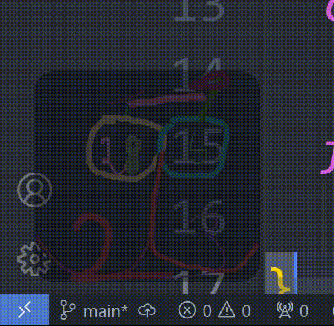
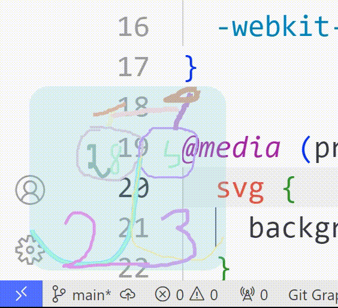

## What it does

Take a look (dark/light):



This app: 
  - is picture-in-picture🖼️(above all) 
  - is click through app👆🏽
  - it keeps you company🐈
  - changes colors smoothly like a cameleon🦎
  - it works with ANY kind of svg👾 (you just have to place it in ./page/index.html>body) 

## Installation

```console
npm i
```

## Developing

```console
npm run dev
```

## Building to windows executable

```console
npm run build
```

## Issues

- Aplicatia nu previne deschiderea de mai multe instante in acelasi timp;

- Si ca sa o inchizi tree sa o cauti prin TaskManager pentru ca focus event este dezactivat pentru ca aplicatia sa fie click-through.
